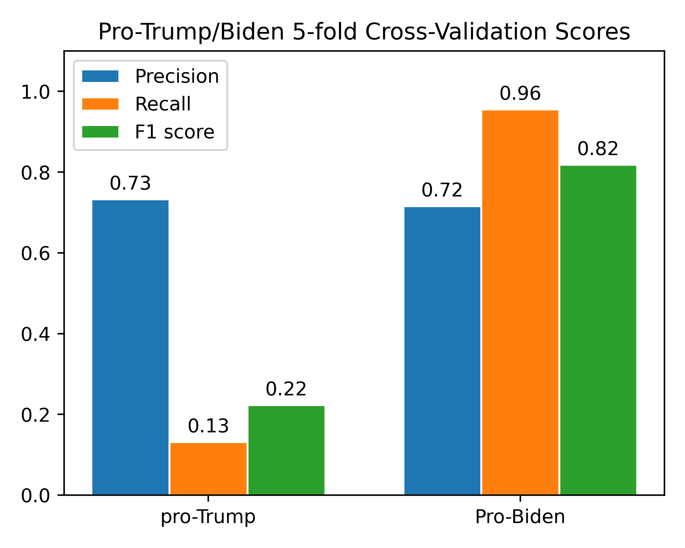

# Modelling

Our group was not entirely happy with the ratio of vitriolic tweets (sum of tweets whose sentiment value via hashtag annotation is not 0) to non-vitriolic tweets (sum of tweets whose sentiment value via hashtag annotation is 0) from the dataset. There was a considerably limited number of vitriolic tweets identified in this manner, so we sought to identify more vitriolic tweets in the dataset that would not have been identified by hashtags. Going through the entire dataset to hand-pick tweets would have been too tedious, so we created a model which would find tweets in the dataset with similar vitriolic intent as those identified with the hashtags.

To this end, we trained two classifiers: one that could detect pro-Biden tweets and one that could detect pro-Trump tweets. For each model, we did the following:

1. Created a set of tweets with any pro-Biden or pro-Trump hashtags
2. Assigned a binary target variable: "1" if the tweet had more hashtags favoring a candidate more than the other; "0" if not
3. Cleaned the tweets by removing hashtags, punctuation, stopwords, and converting to lowercase
4. Transformed the text to vectors using TF-IDF with the 5000 most frequent words 
5. Assess the 5-fold cross-validation performance of a Multinomial Naive Bayes classifier

The 5-fold cross-validation performance is as follows:

</img>

We see a reasonably good precision for both models, which is at least useful to helping ensure a low false-positive rate. The recall is worse for the pro-Trump tweets, interestingly. 

Knowing these models perform reasonably well to identify useful tweets for GPT-2 text generation, we trained the models on the entire dataset used for cross-validation and used it to identify pro-Trump or pro-Biden tweets in the original, larger dataset. 

