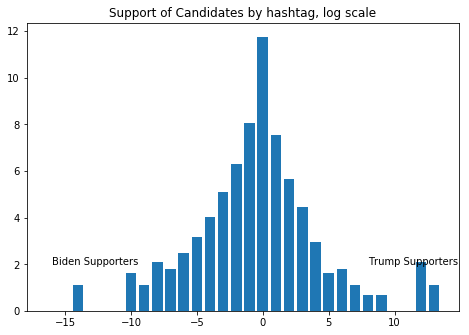
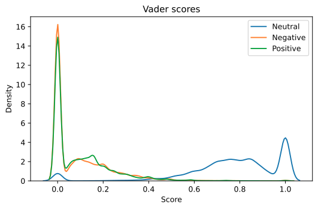
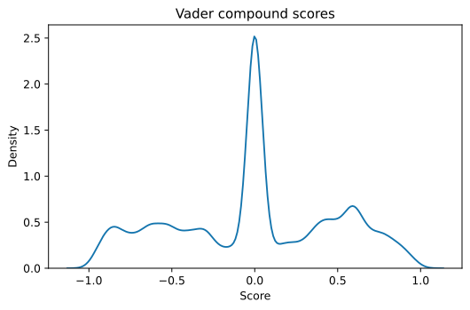
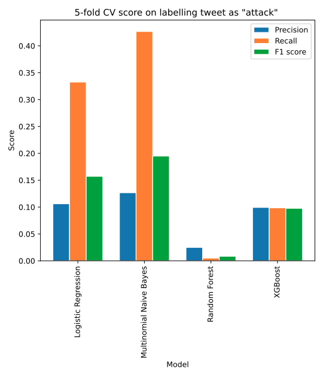
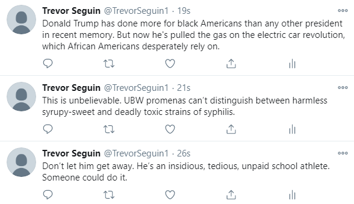

# Introduction

## Research Question 

Advances is Machine Learning text-generation: An exploration in inflammatory political social media posts

## Business Understanding

Slowly, everything in our everyday lives is going online. Roughly 2/5 [41%](https://www.wordstream.com/blog/ws/2019/04/04/ecommerce-statistics) of US consumers order 1-2 packages from Amazon per week and a whopping 83% have made one purchase from Amazon within the last 6 months. This transfer to digital-life has come to the fore during the COVID-19 pandemic. Work, social events, even education has transfered online with the focus of social distancing. Although beneficial to curb the pandemic, social isolationism makes it difficult to keep meaningful social relationships, and many result to communication through digital media.

Digital media is susceptible to misinformation, as have all become acutely aware in this election season, but couldn't humans spot the difference between artificially generated posts and those by humans? Honest and open dissemination of information is critical to American discourse, which pervaids all business transactions. The ability to artifically generate text for the purpose of increasing the temperature of civil discourse can have a significant impact on business public relations.

## Data Understanding/Data Preparation

Datasets:

1. ~140k tweets pertaining to 2020 Presidential Election [link](https://drive.google.com/file/d/1rBJBWWTF9lvKs4pY-PF9Wad91yiW45ol/view?usp=sharing)
2. 5k social media posts from politicians' social media accounts, along with human judgements to about the nature of the tweet, see list below [link](https://www.kaggle.com/crowdflower/political-social-media-posts)

  - attack: the message attacks another politician
  - constituency: the message discusses the politician's constituency
  - information: an informational message about news in government or the wider U.S.
  - media: a message about interaction with the media
  - mobilization: a message intended to mobilize supporters
  - other: a catch-all category for messages that don't fit into the other
  - personal: a personal message, usually expressing sympathy, support or condolences, or other personal opinions
  - policy: a message about political policy
  - support: a message of political support )

Our data consists of two datasets; one, a collection of raw micro-blog posts (tweets) with associated meta-data, and two, a collection of social media posts from politicians along with human judgements on the nature of the post (see above). The second dataset was used to train a machine learning model to detect 'attack/non-attack' judged social posts and applied to the first dataset. This provided a 'tweet intensity' feature to our initial dataset.  

Our plan was to curate 6 tweet subpopulation from dataset 1, spanning the political spectrum (pro-Trump/pro-Biden), the partisan intentsity spectrum (attack/non-attack), and sentiment spectrum (compound score, [VADER](https://github.com/cjhutto/vaderSentiment)). Political sentiment was judged by our team, manually annotating associated hashtags as either pro-Trump (+1), pro-Biden (-1) or neutral (0). After annotation, the hashtags associated with each tweet were summed to give a composite score, ranging from [-1, 1]. Partisan intensity of each tweet was decided via a custom attack/non-attack classifier that was trained on dataset 2 (detailed in models section), with a score of 0 - non-attack, and 1-attack. Sentiment was calculated with the VADER algorithm, a lexicon-based sentiment analyzer, providing a compound score ranging from [-1,1].

The segmented subpopulations of dataset 1 were used as training datasets for [GPT-2](https://github.com/openai/gpt-2), which generated new tweets that were aggregated to new datasets. 

Before segmenting our data for GPT-2 generation, we took a look at the data. For dataset 1, many of the tweets had neutral hashtags (~96%), with 2.5% favorible to biden, and 1.5% favoring trump. 

<text> Histogram of human hashtag annotation for tweet political preference.</text>

Analysis of these tweets with VADER provided more insight to the distribution of sentimental laoding.

<text> Vader componenet scores. Positive, negative and neutral as a fraction of tokens in tweet.</text>

<text> Vader compound sentiment score. The compound score takes token sentiment and context into consideration, ranging from negative, -1, to positive, 1.</text>

The distribution of attack/non-attack social media posts from our sourced dataset was roughly 1:5.

<text>Social media posts labeled attack/non-attack in our sourced dataset.</text>

Using our trained Multinomial Naive-Bayes model, we classified the tweets from dataset 1.

<text>Distribution of attack/non-attack labels given to dataset 1 from our classifier.</text>

## Modeling

As part of the effort to identify higher-intensity tweets, an external dataset at Kaggle with political tweets with labels including 'attack', 'mobilization', 'personal', 'policy' was acquired. The tweet text in the dataset was vectorized using TFIDF, and a corresponding binary target value for 'attack' was assigned (1 or 0, depending on whether it was labelled as 'attack' in the dataset). Scores from 5-fold cross-validation for Precision, Recall, and F1 score were obtained from the following models: Logistic Regression, Multinomial NB, Random Forest, XGBoost

The scores are somewhat low, which points to some difficulty of identifying tweet intent from word content. However, clearly Multinomial Naive Bayes performs best here, and this was used to predict which tweets in the main dataset we are analyzing for this project are 'attack' and higher-intensity. MNB was trained on the whole 'attack' labelled dataset and used to label which tweets are 'attack' in the given dataset.

<text>Classifier model selection. We chose to move forward with Multinomial Niave-Bayes.</text>

## Evaluation

### Subpopulation 1: Attack tweets with low sentiment (compound score < 0)

The following tweets were generated from a GPT-2 model trained on tweets classified as 'attack' or tweets with low sentiment score and posted to Twitter via the Tweepy library:

### Subpopulation 2: Pro-Trump human annoted

The following tweets were generated from a GPT-2 model trained on tweets annotated by human hashtag annotation.

- @JedediahBila "What does it say on the tin? Vote, or we cut it off." #VoteTrump2020NowMoreThanEver

- @Pflax1 @H_A_Kamala #blacklivesmatter #BLM #LatinosforTrump &amp; @realDonaldTrump #MakeAmericaGreatAgain @realDonaldTrump2020 #WalkAway #WalkAwayFromDemocrats

- Just landed in Georgia! The people of this great state know that four more years of President @realDonaldTrump means four more years of America first!  #MAGA

- China OWNS the Biden Crime Family 
You know, besides Obama, Biden, Clintons and Obamagate??
#BidenCrimeFamily

- In just 3 and a half years, we have secured America's Borders, rebuilt the awesome power of the U.S. Military, obliterated the ISIS caliphate, fixed our disastrous Trade Deals, and brought JOBS back home to America – and back to MINNESOTA! #MAGA
Just departed the White House for Minnesota! #MAGA

# Conclusion

In a short amount of time with a relatively small dataset of tweets with a political focus on the election, we were able to demonstrate PoC using GPT-2 to create realistic tweets that have a highly charged sentiment for either candidate. 

## Next Steps

* GPT-2 HyperParameter tuning
* Tuning of tweet selection for the most highly charged examples tous
* deployment of bot on twitter, and logic for selecting users to target 